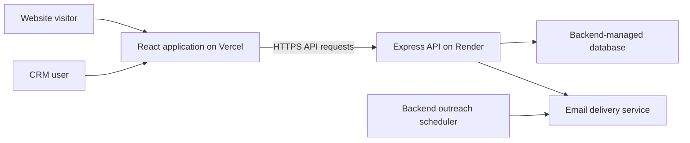
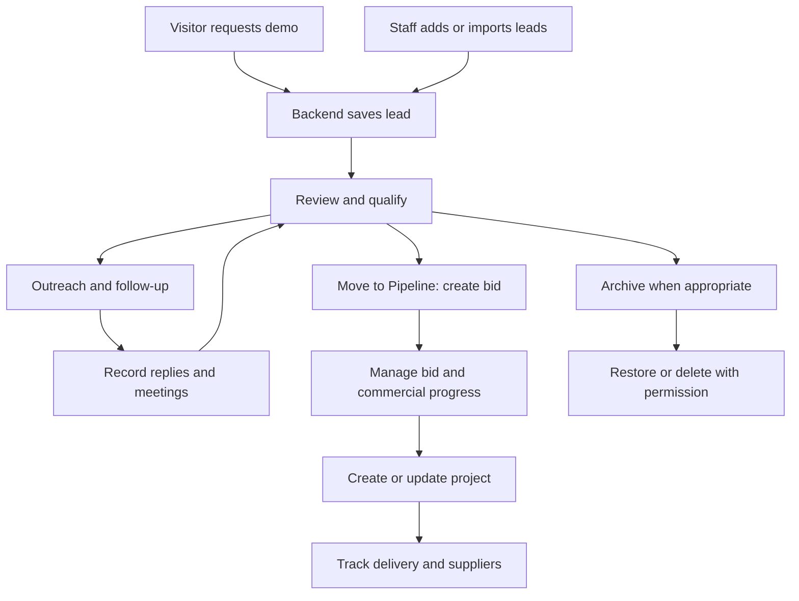
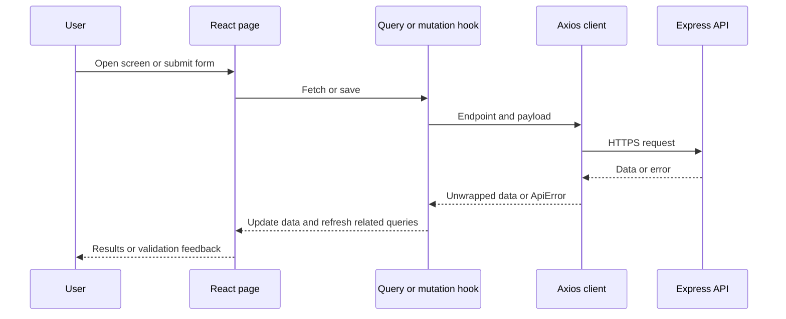

# Twinblueprint project documentation and workflow

Prepared 20 September 2026 from the frontend code, repository README, and deployment handoff shared in this conversation. Implemented features are distinguished from backend-reported results and outstanding production verification. Backend internals were not inspected.

## Purpose and architecture

Twinblueprint combines a public website for 3D visualisation services with an internal CRM for construction, architecture, engineering, and infrastructure sales. Visitors request demos; staff capture and qualify leads, manage commercial opportunities, and track outreach and project progress.

The website and CRM are one React application and use one frontend deployment. The Express API is a separate service.



| Component | Location / responsibility |
| --- | --- |
| Public website | `https://twinblueprint.vercel.app/` |
| CRM login | `https://twinblueprint.vercel.app/crm/login` |
| CRM screens | Routes under `/crm` on the same domain |
| Backend API | `https://twinblueprint-server.onrender.com/api` |
| Database, authorization, email and scheduling | Backend-team responsibilities; not implemented in this frontend repository |

Frontend technologies: React, TypeScript, Vite, React Router, Tailwind CSS, shadcn/ui, TanStack Query, Axios, Recharts, and Framer Motion. The frontend calls the API rather than connecting directly to a database.

## What has been implemented

Here, “implemented” means frontend screens and integrations exist in the code. Production operation also requires working backend endpoints, permissions, data, and service configuration.

| Area | Implemented functionality |
| --- | --- |
| Public website | Home, services, case studies and details, blog, about, process, FAQ, privacy and terms pages |
| Demo capture | Public booking dialog, CRM Home form, validation, industry options, API submission and confirmation-email request |
| Authentication | Username/password login, token storage, session restoration, protected routes, logout and admin passcode integration |
| Leads | Add, view, edit, search, filter, paginate, CSV import/export, archive, restore, delete and move to pipeline |
| Dashboard | KPIs, weekly trends, funnel, qualified leads, regional coverage, application and campaign information |
| Pipeline | Bid/project creation, editing and deletion; dates, phases, values, progress and supplier relationships |
| Supplier network | Supplier profiles, related suppliers, project/bid links, opportunity creation/editing/deletion and linking |
| Outreach | Preview/send integration, message history, campaign management, tracking statistics and manual LinkedIn copying |
| Follow-up sequences | Start, pause, resume, cancel, edit steps, complete/skip steps and refresh progress |
| Replies and meetings | Record/view replies and meetings, reschedule meetings and update outcomes |
| Reporting | Analytics, EMEA and Americas screens connected to API data |
| Error handling | Loading, empty and error states, server field validation, notifications and session-expiry handling |
| Deployment | Vercel build configuration and fallback for direct CRM URLs |

## Main business workflow



This is the business process, not an assertion that every transition is automatic. In particular, project creation has its own controls; automatic conversion of a won bid to a project is not established here.

### 1. Capture enquiries

A visitor opens the public booking dialog, enters contact/company details and selects an industry. The frontend validates the form and calls `POST /api/demo`. It requires a successful HTTP `201` response before reporting submission success. The protected CRM Home form also uses this endpoint.

Demo payloads request confirmation delivery with `confirmationEmail: true`. Actual email and report delivery is a backend responsibility. Staff retrieve saved enquiries through the Leads page.

Staff can also add a lead at `/crm/capture`, which calls `POST /api/leads` with `send_confirmation_email: true`, or import a CSV. Import results distinguish created, skipped and failed records.

### 2. Sign in and restore a session

1. Open `/crm/login` and submit username/password to `POST /api/auth/login`.
2. Store the returned token as `crm_token` in local storage and hold the user in authentication context.
3. Navigate to `/crm/dashboard`.
4. Add `Authorization: Bearer <token>` to API requests when a token exists. Axios also uses `withCredentials: true`.
5. On page reload, validate a stored token with `GET /api/auth/me`.
6. Redirect unauthenticated users away from protected CRM routes to login.
7. A `401` from a non-auth API request clears the token and redirects to login with a session-expiry notice.
8. Logout calls the API and clears the local session even if that request fails.

The frontend recognizes `user` and `admin` roles and includes an admin passcode integration. Backend authorization remains mandatory; frontend visibility rules alone do not enforce permissions.

### 3. Review and qualify leads

Staff enrich a lead with industry, region, country, project information, phase, applications, score, temperature and status.

The main `status` values are `new`, `contacted`, `qualified`, `proposal`, `negotiation`, `lost` and `won`. A separate `lead_status` field represents New, Identified, Bidding, Inflight or Closed. These fields have different meanings.

The Dashboard's Qualified Leads table selects records with main status `qualified` or `won` from its fetched lead list.

### 4. Move to pipeline and manage delivery

The Move to Pipeline form collects project, client, bid phase, deadline and optional value. It calls `POST /api/leads/:id/move-to-pipeline`. The UI's stated backend contract creates a bid and changes the lead status to Proposal. Successful writes refresh leads, bids and pipeline queries.

Bid phases include RFP Review, Technical Eval and Shortlist. Pipeline has separate bid and project editors. Projects track dates, phase, status, progress, value/currency and delivery context. Supplier links connect bids and projects with supplier profiles. Supplier opportunities can be created, updated, deleted and linked through their own APIs.

### 5. Contact leads and record activity

Staff select a lead, prepare a message, preview it, and request an email send. Campaigns group outreach and expose tracking information. LinkedIn messages are copied for manual sending.

Persistent follow-up sequences combine email, LinkedIn and phone steps. Sequence data refreshes every 15 seconds. Controls support starting, pausing, resuming, cancelling, editing unattempted steps, and recording manual completion. Backend workers deliver scheduled emails; LinkedIn and phone actions remain manual.

Replies are explicitly recorded; automatic inbox reply detection is not established. Per the documented backend contract, saving a reply pauses its applicable active sequence. Meetings can be recorded, rescheduled and given outcomes. Successful activity writes refresh related statistics and sequence data.

### 6. Archive and restore

Archive updates a lead with `archived: true`. The archived list requests `GET /api/leads?archived=true`; restore sets the flag to false. Permanent deletion uses `DELETE /api/leads/:id` and requires backend permission checks. Archive retains a record; deletion is a separate action.

## Screen map

| Route | Purpose |
| --- | --- |
| `/` | Public homepage |
| `/services` | Services |
| `/case-studies`, `/case-studies/:id` | Case studies and details |
| `/blog`, `/about`, `/how-it-works`, `/faq` | Public information |
| `/privacy-policy`, `/terms` | Legal information |
| `/crm/login` | Login |
| `/crm` | Protected CRM Home and demo form |
| `/crm/dashboard` | Overview and KPIs |
| `/crm/leads` | Lead management |
| `/crm/archived` | Archived leads |
| `/crm/capture` | Manual lead capture |
| `/crm/pipeline` | Bids, projects and supplier tools |
| `/crm/outreach` | Campaigns, messages, sequences and activity |
| `/crm/emea`, `/crm/americas` | Regional reporting |
| `/crm/analytics` | Analytics |

## Technical request flow



The ordinary response envelope is `{ success, data, message? }`. The client unwraps `data` and normalizes errors, including server field validation. Dedicated helpers support uploads, downloads and operations that require HTTP `201`. TanStack Query caches reads and refreshes affected queries after writes.

| API group | Representative paths under `/api` |
| --- | --- |
| Authentication | `/auth/login`, `/auth/passcode`, `/auth/me`, `/auth/logout` |
| Capture and leads | `/demo`, `/leads`, `/leads/options`, `/leads/import`, `/leads/export`, `/leads/:id/move-to-pipeline` |
| Options and regions | `/industries`, `/regions`, `/regions/emea`, `/regions/americas` |
| Pipeline | `/pipeline`, `/bids`, `/projects`, `/suppliers`, `/opportunities` |
| Reporting | `/analytics/kpis`, `/analytics/weekly`, `/analytics/funnel`, `/analytics/dashboard` |
| Outreach | `/outreach/preview`, `/outreach/send`, `/outreach/messages`, `/campaigns`, `/campaigns/stats` |
| Activity | `/outreach/sequences`, `/outreach/replies`, `/outreach/meetings`, `/outreach/stats` |

This is an integration map. Consult the hooks for methods/payloads and the backend for its full API specification.

## Deployment and fixes completed

| Setting | Value |
| --- | --- |
| Vercel root directory | Repository root containing `package.json` and `vercel.json`; not `src/crm` |
| Framework | Vite |
| Build command | `npm run build` |
| Output directory | `dist` |
| Production API variable | `VITE_API_BASE_URL=https://twinblueprint-server.onrender.com/api` |
| Frontend origin | `https://twinblueprint.vercel.app` |

The deployment troubleshooting covered three issues:

1. **Direct CRM URLs returned 404.** Added `vercel.json` with explicit Vite build settings and a rewrite from `/(.*)` to `/index.html`. React Router can then handle direct links and refreshes. A local production build passed during this change.
2. **Production called localhost.** The frontend was configured to use the deployed Render API. Subsequent browser errors showed the Render URL, confirming the new address was being used. Vite embeds environment variables at build time, so frontend environment changes require a new deployment.
3. **CORS blocked responses.** The backend team reported deploying and verifying the Vercel origin, credential support, `Content-Type`/`Authorization` headers, and CORS headers on errors. Their handoff reported industries returning `200` and login preflight returning `204`. Successful browser login after this fix has not yet been confirmed in the conversation.

During troubleshooting, the local Git remote was `keduniiii-dev/meta-view-creator`, while the Vercel import shared by the user referenced `Odusdegreat/Twinblueprint`. Verify the connected repository and production branch before publishing changes; a push elsewhere does not update the deployment.

The API URL is public frontend configuration. Database credentials and email-provider secrets belong on the backend. Preview deployments require their own approved origin handling when calling the API directly.

## Known limitations and outstanding verification

- **Outreach/campaign fallback:** The email-send mutation now requires API success; failures no longer fabricate a local sent message. Deploy this frontend change for it to take effect. Some preview, history and campaign hooks still fall back to a browser-local store when the API is unreachable or returns `404`/`501`; those results should not be treated as proof of backend persistence. API acceptance is also distinct from provider-confirmed delivery.
- **Scheduled email readiness:** The existing README keeps live scheduled-send testing on hold. Backend prerequisites include the CRM, sequence and activity migrations, `OUTREACH_SCHEDULER_ENABLED=true`, a running worker, and `RESEND_API_KEY`/`FROM_EMAIL`. A scheduler flag alone does not establish worker or provider health.
- **Manual channels and timing:** LinkedIn and phone actions remain manual. Replies require explicit recording. Per the backend handoff documented in the README, resuming sequences retains due dates and can dispatch overdue emails immediately.
- **Reporting limits:** Relevant Dashboard/Pipeline queries fetch up to 100 leads, bids or projects. Displayed lists and locally derived summaries should not be assumed to represent all records in larger datasets. Dedicated aggregate APIs are separate.
- **Backend scope:** Database schema, authorization internals, worker behavior and email delivery require backend verification. The frontend code alone does not establish those guarantees.
- **Production acceptance:** The CORS fix was reported verified by the backend team; a full browser walkthrough remains to be confirmed. No live sends or destructive production actions were performed for this documentation.

## Development and source organization

```bash
npm install
npm run dev
```

For local development, create `.env.local` with:

```env
VITE_API_BASE_URL=/api
```

Vite serves the frontend on port 8080 and proxies `/api` to the local backend on port 5000. This proxy does not run in the deployed static build. Without `VITE_API_BASE_URL`, the current client defaults to `http://localhost:5000/api`.

| Command | Purpose |
| --- | --- |
| `npm run build` | Generate production output |
| `npm run preview` | Preview the build locally |
| `npm run lint` | Run ESLint |
| `npm run test` | Run Vitest |
| `npm run test:watch` | Watch tests |

On Windows, use `npm.cmd` if PowerShell blocks the `npm.ps1` wrapper.

| Source | Responsibility |
| --- | --- |
| `src/App.tsx` | Routes and providers |
| `src/pages/`, `src/components/` | Public website and shared components |
| `src/crm/pages/`, `src/crm/components/` | CRM screens and forms |
| `src/crm/layout/` | Navigation and layout |
| `src/hooks/` | Authentication and API queries/mutations |
| `src/lib/api.ts`, `src/lib/types.ts` | API client and data contracts |
| `src/crm/lib/` | Local store and fallback behavior |
| `src/test/` | Automated tests |
| `vite.config.ts`, `vercel.json` | Development/build and deployment settings |

Existing tests cover lead editing, archive access, CSV handling, demo requests, bids/projects, pipeline, suppliers, outreach, sequences, activity, regional screens, money handling and server errors. Their presence is not a current pass report; they were not rerun for this documentation-only change.

## Acceptance walkthrough

Use designated test data and coordinate email delivery with the backend team.

1. Open the homepage, then directly open and refresh `/crm/login`.
2. Confirm browser requests reach Render, not localhost, and responses are readable.
3. Log in, refresh a protected page, log out, and verify unauthenticated redirects.
4. Submit a test demo and verify the saved lead and requested confirmation delivery.
5. Edit and qualify the lead; verify details and dashboard visibility.
6. Move it to Pipeline; verify the bid and proposal status, then check project/supplier links.
7. Verify outreach persistence and provider delivery independently of success notifications. Test scheduled email only after backend readiness is confirmed.
8. Record a reply and meeting; verify sequence pause behavior, updates and statistics.
9. Verify archive/restore permissions with test records and compare reporting with backend data.

Further reference: [repository README](../README.md).
